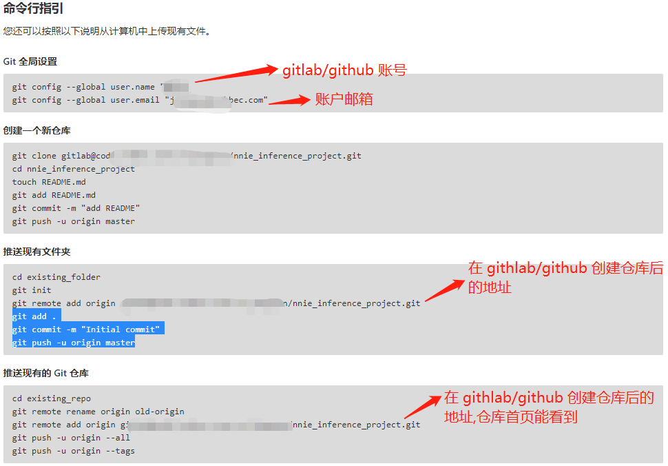
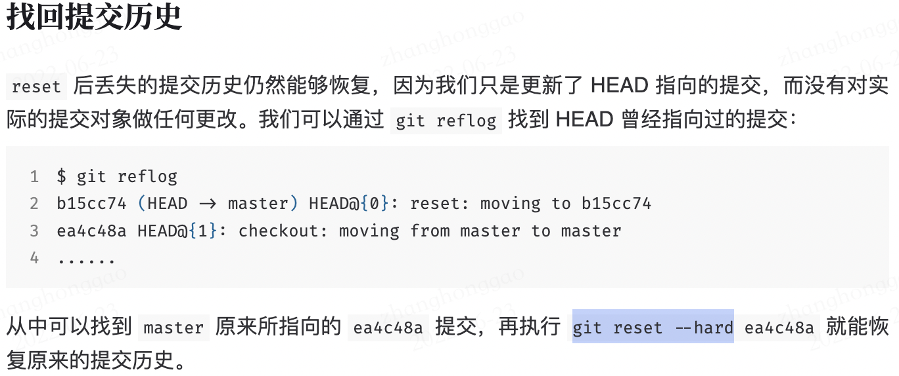

# git 命令学习笔记
## git 创建代码仓库
第一步：刚下载安装的 `git` 都需要先配置用户名和邮箱：

```Plain Text
git config --global user.name "HarleysZhang"
git config --global user.email "ZHG5200211@outlook.com"
```
第二步：要想从 `github` 或者 `gitlab` 上实现 `clone/pull/push` 等操作，首先就得在本地创建 `SSH Key` 文件，在用户主目录下，查看是否有 `.ssh` 目录，看这个目录下是否有 `id_rsa` 和 `id_rsa.pub` 这两个文件，如果没有，则需要打开 shell（windows 系统打开Git Bash），在命令行中输入:

```bash
ssh-keygen -t rsa -C "youremail@example.com"
```
> SSH 概述： \*\*SSH(Secure Shell) \*\* 是一种网络协议，用于计算机之间的加密登录。如果一个用户从本地计算机，使用SSH协议登录另一台远程计算机，我们就可以认为，这种登录是安全的，即使被中途截获，密码也不会泄露，原因在于它采用了非对称加密技术(RSA)加密了所有传输的数据。

第三步：登录 `Github`，打开 `"Account settings”`，“SSH Keys”页面，然后，点“Add SSH Key”，填上任意Title，在Key文本框里粘贴id\_rsa.pub文件的内容，点“Add Key”，就可以看到已经添加的 `Key` 了。之后你就可以玩转 `Git`了。

> 为什么GitHub需要SSH Key呢？
因为GitHub需要识别出你推送的提交确实是你推送的，而不是别人冒充的，而Git支持SSH协议，所以，GitHub只要知道了你的公钥，就可以确认只有你自己才能推送。

第四步：上传项目到 github 仓库。配置好用户名和密码后，接下来就是将本地项目代码上传到 `github/gitlab` 仓库了。
在前面的准备工作完成后，你首先可以在 `gitlab/github` 新建仓库后，这样会得到一个仓库地址，这时候你可以把本地的文件夹上传到这个仓库地址，具体操作步骤命令如下：

```bash
# 推送现有文件夹到远程仓库地址
cd existing_folder
git init
git remote add origin "你的仓库地址"
git add .
git commit -m "Initial commit"
git push -u origin master
```
其他上传方式命令如下图：



## git 基本知识
本地仓库由 git 维护的三棵“树"组成。

* 第一个是 `工作目录`，它持有实际文件；
* 第二个是`暂存区(Index)`，它像个缓存区域，临时保存仓库做的改动;
* 最后是 `Head`，它指向我们的最后一次提交的结果。

对于`分支`来说，在创建仓库的时候，`master` 是”默认的“分支。一般在项目中，要先在其他分支上进行开发，完成后再将它们合并到主分支上 `master`上。
不建议使用pull拉取最新代码，因为pull拉取下来后会自动和本地分支合并。

## git 基本操作
```bash
git init       # 创建新的git仓库
git status  # 查看状态
git branch # 查看分支
git branch dev  # 创建dev分支
git branch -d dev  # 删除 dev 分支
git push origin --delete dev # 删除远程分支 【git push origin --参数远程分支名称】
git branch -a # 查看远程分支
git checkout -b dev # 基于当前分支(master)创建dev分支，并切换到dev分支，dev 分支会关联到 master 分支上
git checkout -f test        # 强制切换至 test 分支，丢弃当前分支的修改
git checkout master  # 切换到master分支
git add filename  # 添加指定文件，把当前文件放入暂存区域
git add .  # 表示添加新文件和编辑过的文件不包括删除的文件
git add -A  # 表示添加所有内容
git commit  # 给暂存区域生成快照并提交
git reset -- files # 用来撤销最后一次 git add files，也可以用 git reset 撤销所有暂存区域文件
git push origin master  # 推送改动到master分支（前提是已经clone了现有仓库）
git remote add origin <server>  # 没有克隆现有仓库，想仓库连接到某个远程服务器
git pull  # 更新本地仓库到最新版本（多人合作的项目），以在我们的工作目录中 获取（fetch） 并 合并（merge） 远端的改动
git diff <source_branch> <target_branch>  # 查看两个分支差异
git diff  # 查看已修改的工作文档但是尚未写入缓冲的改动
git rm <file>  # 用于简单的从工作目录中手工删除文件
git rm -f <file>  # 删除已经修改过的并且放入暂存区域的文件，必须使用强制删除选项 -f
git mv <file>  # 用于移动或重命名一个文件、目录、软链接
git log  # 列出历史提交记录
git remote -v # 列出所有远程仓库信息, 包括网址
```
## git 操作实例
1，**将其他分支更改的操作提交到主分支**：

```bash
git checkout master  # 切换回master分支(当前分支为dev)
git merge dev  # 合并（有合并冲突的话得手动更改文件）
```
2，**git**** 如何回退版本**：

```bash
git log  # 查看分支提交历史，确认要回退的历史版本
git reset --hard  [commit_id]  # 恢复到历史版本
git push -f -u origin branch  # 把修改推送到远程仓库 branch 分支
```
4，**拉取远程分支到本地**：

```bash
# 本地已经拉取了仓库代码，想拉取远程某一分支的代码到本地
git checkout -b ac_branch origin/ac_branch   # 拉取远程分支到本地(方式一)
git fetch origin ac_branch:ac_branch  # 拉取远程分支到本地(方式二)
```
5，**查看本地已有分支**

```bash
# 显示该项目的本地的全部分支，当前分支有 * 号
git branch
```
6，**查看本地分支和原称分支差异**


7，**回退版本**



## git 操作的一些问题
1. git 解决 fatal: 'origin' does not appear to be a git repository问题。
控制台输入：
`git remote add origin git@github.com:xxse/xx.git`
2. 推送本地新创建分支到远程仓库新分支
`git push origin local_branch:remote_branch`

## 参考资料
3. [Git 教程](https://www.runoob.com/git/git-tutorial.html)
4. [图解Git](http://marklodato.github.io/visual-git-guide/index-zh-cn.html)
5. [git documentation](https://git-scm.com/doc)
6. [Git 使用简明手册](https://opus.konghy.cn/git-guide/)